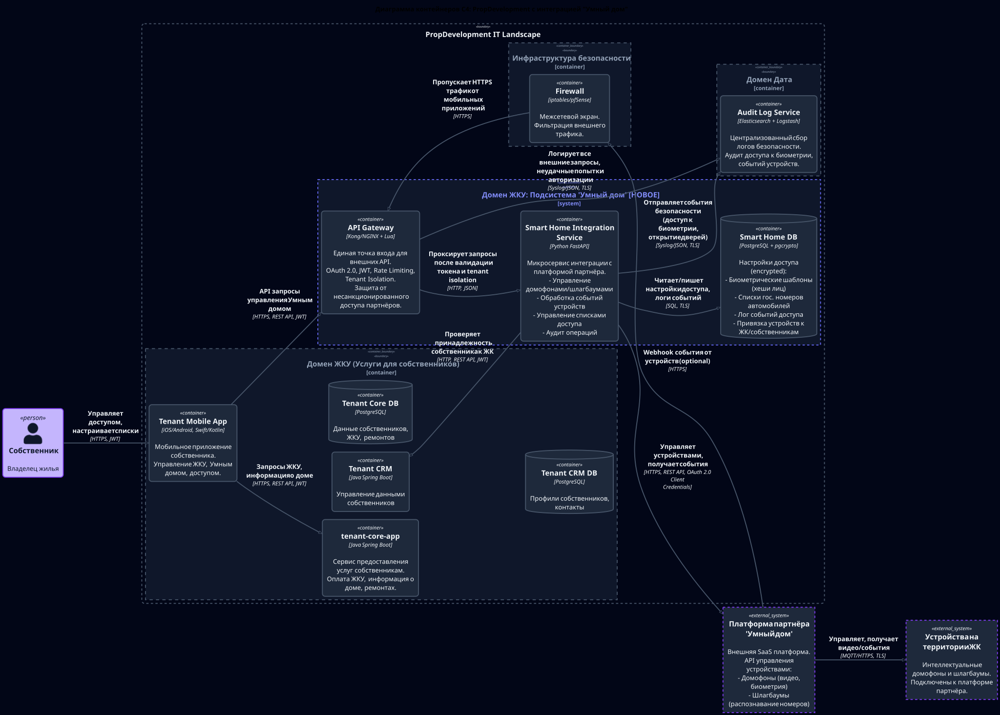

# PropDevelopment Security & Architecture Tasks


Сборник решений заданий курса Architecture Pro - от классификации данных до настройки Kubernetes RBAC, сетевых политик и admission-контроля.

## Навигация по заданиям

| # | Задание | Ключевые артефакты |
|---|---------|--------------------|
| 1 | Классификация данных и оценка рисков | [Mindmap](Task1/data-security-mindmap.svg) • [Обоснования](Task1/README.md) |
| 2 | Проверочный лист безопасности бизнес-систем | [README](Task2/README.md) • [Checklist](Task2/security-checklist.md) |
| 3 | Интеграция «Умного дома» | [Контекст](Task3/C4_Context.svg) • [Контейнеры](Task3/C4_Container.svg) • [Требования](Task3/001-security-requirements.md) |
| 4 | Kubernetes RBAC | [README](Task4/README.md) • [Манифесты](Task4/manifests) • [Verify Script](Task4/scripts/verify-rbac.sh) |
| 5 | Kubernetes Network Policies | [README](Task5/README.md) • [Политики](Task5/manifests) • [Тесты](Task5/scripts/test-network-policies.sh) |
| 6 | Аудит и анализ Kubernetes | [README](Task6/README.md) • [Скрипты](Task6/scripts) • [Audit Extract](Task6/audit-extract.json) |
| 7 | PodSecurity + Gatekeeper | [README](Task7/README.md) • [Makefile](Task7/Makefile) • [Verify Scripts](Task7/verify) |


## Как запускать проверки

```bash
# Task4 — RBAC
make -C Task4 validate apply verify delete

# Task5 — Network Policies
make -C Task5 validate apply test delete

# Task6 — Audit & Analysis
sudo make -C Task6 setup
make -C Task6 simulate
sudo make -C Task6 analyze

# Task7 — PodSecurity & Gatekeeper
make -C Task7 setup verify-admission validate-security clean
```

## Быстрые ссылки на ключевые диаграммы

<div align="center">
  
  
</div>

