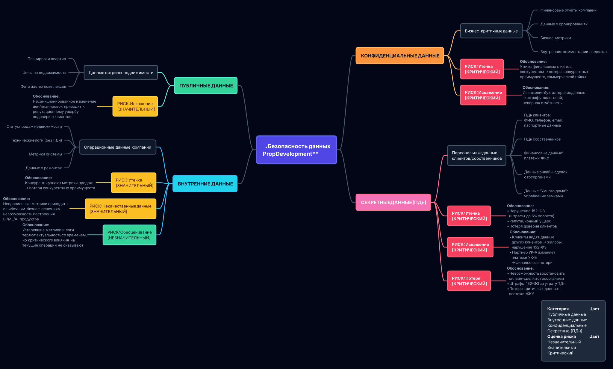

# Задание 1. Разработка проверочного листа по безопасности данных

## Описание

Проверочный лист по безопасности данных PropDevelopment в формате mindmap [Data Security Mindmap](data-security-mindmap.puml).

## Классификация данных по ISO/IEC 27001 и 27002

### 1. Публичные данные
**Определение**: Данные, доступные без аутентификации, утечка которых не наносит ущерба.

**Данные PropDevelopment**:
- Витрина недвижимости: планировки квартир, цены, фото жилых комплексов

**Риски**:
- **Искажение (Значительный)**: Несанкционированное изменение цен или планировок приводит к репутационному ущербу и недоверию клиентов.

---

### 2. Внутренние данные
**Определение**: Данные, доступные сотрудникам компании, не содержащие ПДн. Утечка может нанести ущерб бизнесу, но не влечёт юридических последствий.

**Данные PropDevelopment**:
- Статус продаж недвижимости
- Технические логи (без идентификаторов пользователей)
- Метрики системы
- Данные о ремонтах (без привязки к собственникам)

**Риски**:
- **Утечка (Значительный)**: Конкуренты узнают метрики продаж → потеря конкурентных преимуществ.
- **Некачественные данные (Значительный)**: Неправильные метрики приводят к ошибочным бизнес-решениям, невозможности построения BI/ML/AI продуктов.
- **Обесценивание (Незначительный)**: Устаревшие метрики и логи теряют актуальность со временем, но критического влияния на текущие операции не оказывают.

---

### 3. Конфиденциальные данные
**Определение**: Данные, критичные для бизнеса, требующие строгого контроля доступа. Утечка наносит серьёзный ущерб.

**Данные PropDevelopment**:
- Финансовые отчёты компании
- Данные о бронированиях
- Бизнес-метрики
- Внутренние комментарии о сделках

**Риски**:
- **Утечка (Критический)**: Утечка финансовых отчётов конкурентам → потеря конкурентных преимуществ, раскрытие коммерческой тайны.
- **Искажение (Критический)**: Искажение бухгалтерских данных → штрафы налоговой, неправильная отчётность.

---

### 4. Секретные данные
**Определение**: Данные максимального уровня конфиденциальности (ПДн, критичные бизнес-данные). Утечка влечёт юридические последствия и катастрофический ущерб.

**Данные PropDevelopment**:
- ПДн клиентов: ФИО, телефон, email, паспортные данные
- ПДн собственников
- Финансовые данные клиентов: платежи ЖКУ
- Данные онлайн-сделок с госорганами
- Данные "Умного дома": управление замками

**Риски**:
- **Утечка (Критический)**:
  - Нарушение 152-ФЗ "О персональных данных" → штрафы до 6% годового оборота (ст. 13.11 КоАП)
  - Репутационный ущерб (у конкурента произошла утечка данных, активно обсуждалась в СМИ)
  - Потеря доверия клиентов

- **Искажение (Критический)**:
  - Клиенты видят данные других клиентов  - "там иногда могут отображаться данные другого клиента - например, другое Ф. И. О." → жалобы клиентов, нарушение 152-ФЗ
  - Партнёр из управляющей компании А может изменить данные клиентов управляющей компании Б → финансовые потери, судебные иски

- **Потеря (Критический)**:
  - Невозможность восстановить онлайн-сделки с госорганами (Росреестр, ФНС, нотариус)
  - Штрафы 152-ФЗ за утрату ПДн
  - Потеря критичных данных для бизнеса (платежи ЖКУ, история транзакций)

---

## Оценка рисков

### Незначительный риск
Риск, который можно принять без дополнительных мер защиты. Влияние на бизнес минимально.

**Примеры в PropDevelopment**:
- Обесценивание внутренних данных (устаревшие метрики и логи)

### Значительный риск
Риск требует внимания и реализации мер защиты. Влияние на бизнес заметно, но не катастрофично.

**Примеры**:
- Искажение публичных данных
- Утечка внутренних данных
- Некачественные внутренние данные

### Критический риск
Риск требует немедленных действий. Влияние на бизнес катастрофическое: юридические последствия, штрафы, репутационный ущерб.

**Примеры**:
- Все риски для секретных данных (утечка/искажение/потеря ПДн)
- Утечка/искажение конфиденциальных данных

---

### Проблема 1: Нарушен контроль данных
**Связь с рисками**:
- Внутренние данные → Некачественные данные (несколько точек регистрации клиентов без координации)
- Секретные данные → Искажение (клиент видит данные другого клиента)

### Проблема 2: API партнёров без единых политик
**Связь с рисками**:
- Секретные данные → Утечка (избыточная передача ПДн)
- Секретные данные → Искажение (партнёр УК-А изменяет данные УК-Б)

### Проблема 3: Потребность в Data-продуктах
**Связь с рисками**:
- Внутренние данные → Некачественные данные (блокировка BI/ML/AI из-за проблем управления потоками данных)

---

## Источники

- ISO/IEC 27001:2022 - Information security management systems
- ISO/IEC 27002:2022 - Information security controls (Annex A.5.12 "Classification of information")
- 152-ФЗ "О персональных данных" Российской Федерации
- Case Description - описание системы и проблем PropDevelopment
